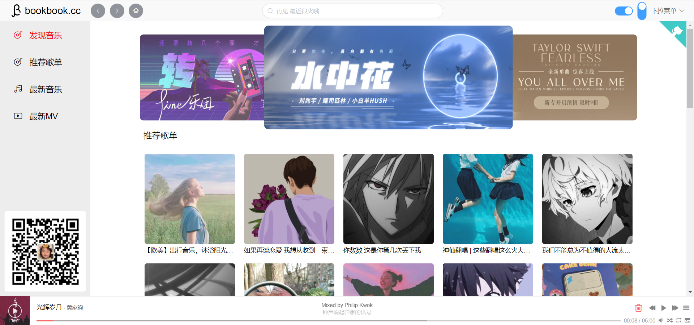
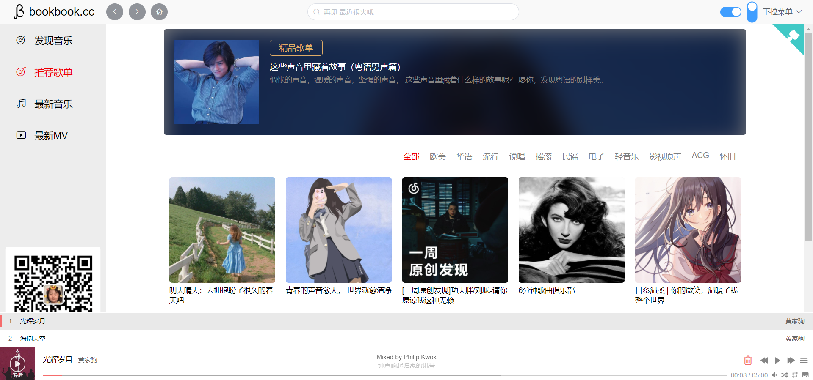
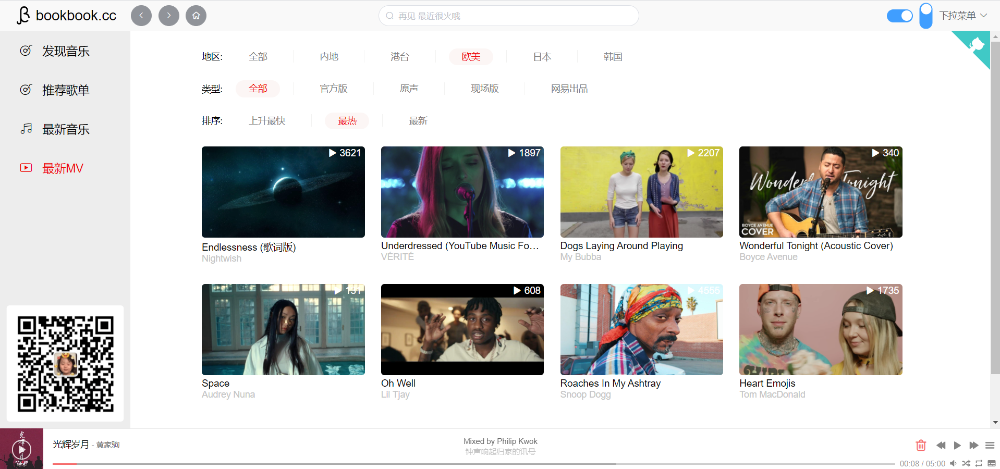
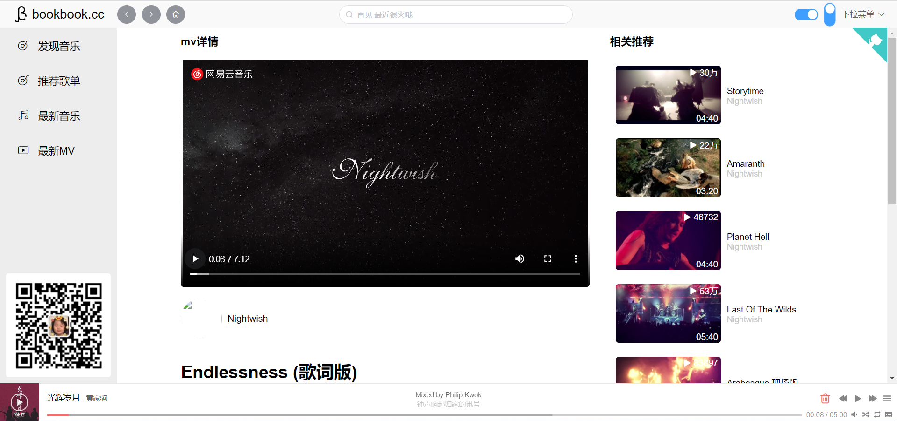

## 仿网易播放器 CloudMusic | 米奇妙妙屋
作者：[bookbook](https://www.bookbook.cc/) 

预览地址：[www.bookbook.cc/Music](https://bookbook.cc/music/) 

前端地址(源码)：[CloudMusic](https://gitee.com/penggang-home/cloud-music) 

后端地址(源码)：[NeteaseCloudMusicApi](https://github.com/Binaryify/NeteaseCloudMusicApi) 

接口文档：[API接口文档](https://neteasecloudmusicapi.vercel.app/#/?id=neteasecloudmusicapi) 

## 说明
如果你觉得本项目对你有帮助的话，请点个 Star 支持一下🐷(一个赞都没有，太可怜了)

在学习该项目的过程中,如果你遇到任何问题都可以联系我,文末有联系方法。

[www.bookbook.cc](https://www.bookbook.cc/) 这是我的个人主页,你也可以在上面找到我的联系方式。

## 技术栈
- Vue
- VueRouter
- VueX
- ElementUi
- ES6、CSS3
- Vue-Aplayer
- lazy-load

## 一、如何运行该项目？
首先 clone 该项目
```
git clone https://gitee.com/penggang-home/cloud-music.git
```
进入该项目后，安装依赖
```
npm install
```
运行该项目
```
npm run serve
```

> 注：如果数据加载不出来，可能是接口更换。
## 二、预览截图

### 2.1 首页(展开)



### 2.2 首页(折叠)


### 2.3 歌单页



### 2.4 MV列表页


### 2.5 MV播放页

